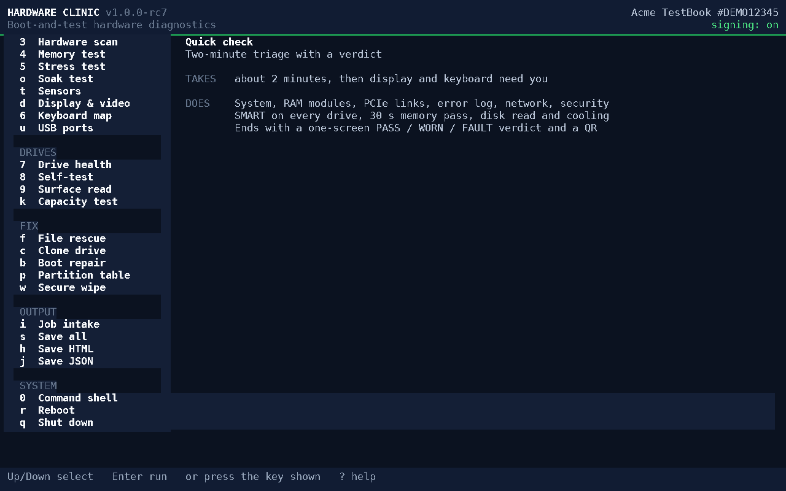
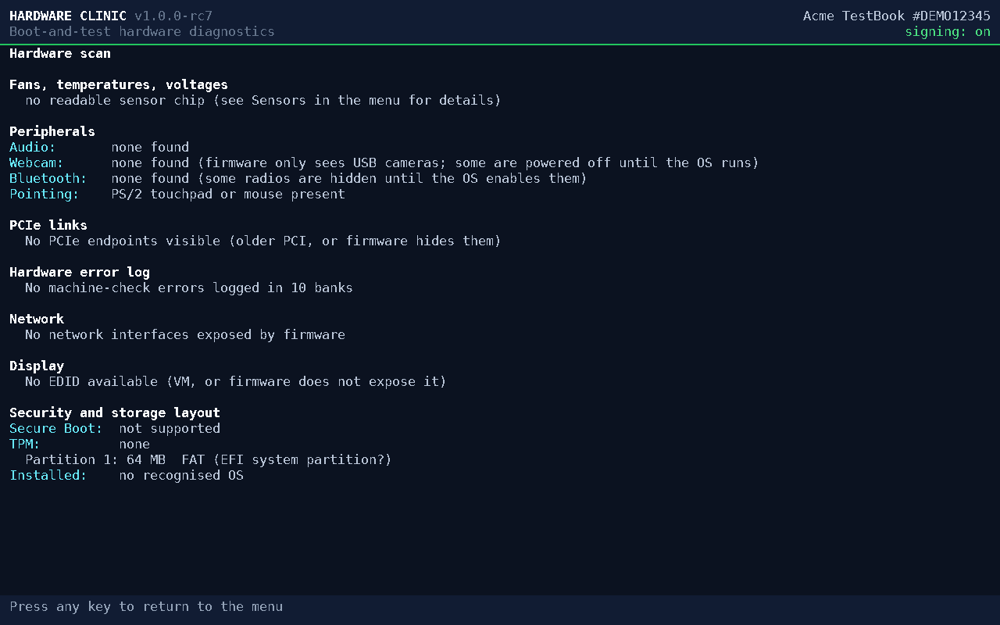

# Hardware Clinic

**Boot-and-test hardware diagnostics on a USB stick.** Plug it in, boot, and in about one second you
have a full diagnostic bench — no Windows, no Linux, no install, ~90 KB. Works on any UEFI PC and
Intel Mac.

  

> ⚠️ **This tool can permanently erase data.** It includes secure-wipe, drive-clone and
> partition-repair tools that overwrite disks. It is provided **as-is, with no warranty**, and the
> author is **not liable for any data loss or damage**. You are responsible for what you run it on.
> See [LICENSE](LICENSE).

## What it does
- **Quick check** — a two-minute PASS / WORN / FAULT verdict on RAM, drives, cooling, video memory,
  hardware error log, network, display and keyboard.
- **Diagnose** — SMART and drive self-tests, surface read with bad-sector repair, multi-core memory
  test (names the faulty module), stress test with temperature and per-core analysis, counterfeit-
  capacity test, USB-port test, PCIe link health, fans/voltages, peripherals, OS-version detection.
- **Fix & rescue** — copy a customer's files off an NTFS, ext4 or APFS drive that won't boot; clone a
  failing drive around its bad sectors; repair boot entries and destroyed partition tables.
- **Certify** — secure wipe with a signed certificate (text, printable HTML, and an on-screen QR a
  phone can verify), for resale and disposal.

Every result is signed with the stick's own key; `tools/verify.py` checks any report, certificate or
QR later.

## Screenshots

| Built-in guide — which tool for which complaint (press `?`) | Structured, signed results (Hardware scan) |
|:---:|:---:|
|  |  |

## Get it
1. Download `hardware-clinic-<version>.img` from the [latest release](https://github.com/jmsmediagroup/hardware-clinic/releases/latest)
   and check it against `SHA256SUMS`.
2. Write it to a USB stick (**this erases the stick**):
   - **macOS:** `diskutil unmountDisk /dev/diskN && sudo dd if=hardware-clinic-<version>.img of=/dev/rdiskN bs=1m`
   - **Linux:** `sudo dd if=hardware-clinic-<version>.img of=/dev/sdX bs=1M conv=fsync`
   - **Windows:** [Rufus](https://rufus.ie) or balenaEtcher, in DD/image mode.
3. Boot from it: PC — tap the boot-menu key (F12/F9/Esc/F10) and pick the **UEFI:** USB entry;
   Intel Mac — hold **Option** and choose EFI Boot. If it doesn't appear, disable **Secure Boot** in
   firmware settings (this free build isn't Microsoft-signed).

Press **?** in the menu for a guide to which tool fits which problem.

**Known limitation:** on laptops whose BIOS sets the storage mode to **Intel RST / RAID** (many Acer,
Dell, HP models), the SSD is hidden from every standard interface, so SMART and drive self-tests
are unavailable until the mode is switched to AHCI. The tool tells you when this is the case.

## Free vs. commercial
Free for personal, non-commercial use. **Repair shops, IT departments and any business use need a
licence** — which also unlocks Secure-Boot-signed builds (no BIOS changes on customer machines),
the fleet/unattended features, updates and support. See [COMMERCIAL.md](COMMERCIAL.md).

## Licence
Proprietary; free for personal use only. Not open source. See [LICENSE](LICENSE) and [NOTICE](NOTICE).
Bundled third-party components (TweetNaCl, qrcodegen, DejaVu font) keep their own licences.
