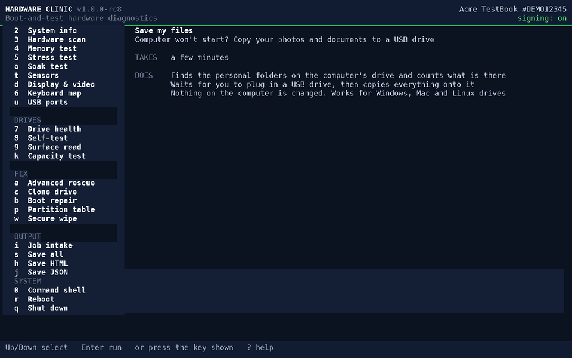
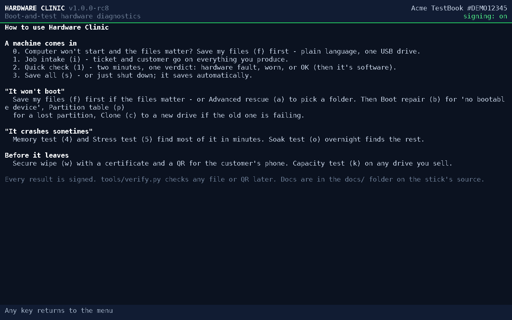
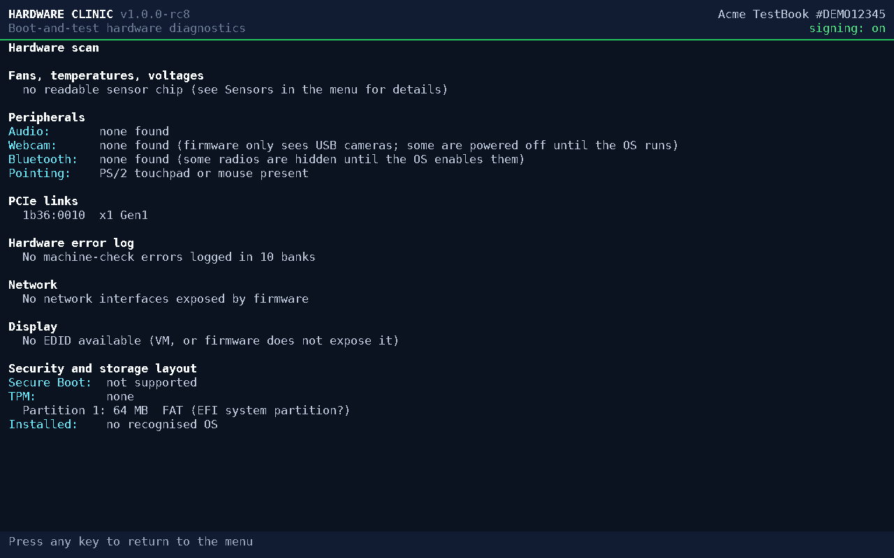

# Hardware Clinic

**Boot-and-test hardware diagnostics on a USB stick.** Plug it in, boot, and in about one second you
have a full diagnostic bench — no Windows, no Linux, no install. The whole thing is one ~360 KB UEFI
program, built from scratch with no libraries. Works on any UEFI PC and Intel Mac.

## Download

| Your computer | Download | Then |
|---|---|---|
| **Windows** | [**Make-Hardware-Clinic-Stick.exe**](https://github.com/jmsmediagroup/hardware-clinic/releases/latest/download/Make-Hardware-Clinic-Stick.exe) · 67 MB | Run it and pick your USB stick. |
| **Mac** | [**Make-Hardware-Clinic-Stick.command**](https://github.com/jmsmediagroup/hardware-clinic/releases/latest/download/Make-Hardware-Clinic-Stick.command) **and** [**hardware-clinic-1.0.0-rc8.img**](https://github.com/jmsmediagroup/hardware-clinic/releases/download/v1.0.0-rc8/hardware-clinic-1.0.0-rc8.img) · 64 MB | Put both in one folder and double-click the `.command`. |
| **Linux** | [**hardware-clinic-1.0.0-rc8.img**](https://github.com/jmsmediagroup/hardware-clinic/releases/download/v1.0.0-rc8/hardware-clinic-1.0.0-rc8.img) · 64 MB | `sudo dd if=hardware-clinic-1.0.0-rc8.img of=/dev/sdX bs=1M conv=fsync` or [`tools/flash.sh`](tools/flash.sh) |
| Virtual machine | [hardware-clinic-1.0.0-rc8.iso](https://github.com/jmsmediagroup/hardware-clinic/releases/download/v1.0.0-rc8/hardware-clinic-1.0.0-rc8.iso) · 64 MB | Boot it as a CD image. |

**Version 1.0.0-rc8** · free for personal use · the stick boots UEFI PCs and Intel Macs (not Apple Silicon) ·
[all files and checksums](https://github.com/jmsmediagroup/hardware-clinic/releases/latest)

  

The rc8 image booted in QEMU/OVMF: menu → System info → Drive health → Memory test on 4 cores. Same UI on real hardware.

> ⚠️ **This tool can permanently erase data.** It includes secure-wipe, drive-clone and
> partition-repair tools that overwrite disks. It is provided **as-is, with no warranty**, and the
> author is **not liable for any data loss or damage**. You are responsible for what you run it on.
> See [LICENSE.txt](LICENSE.txt).

## Computer won't start and your files are on it?

Boot the stick, press **f** ("Save my files"), and plug in a USB drive when it asks. It finds your
photos and documents, tells you how many there are, copies them across, and tells you where they went.
**Nothing on the computer is changed.** Works with Windows, Mac and Linux drives.

Encrypted drives (BitLocker, FileVault, LUKS) are detected and explained in plain words — without the
password there is nothing any tool can do.

## What it does
- **Quick check** — a two-minute PASS / WORN / FAULT verdict on RAM, drives, cooling, video memory,
  hardware error log, network, display and keyboard.
- **Diagnose** — SMART and drive self-tests, surface read with bad-sector repair, multi-core memory
  test (names the faulty module), stress test with temperature and per-core analysis, counterfeit-
  capacity test, USB-port test, PCIe link health, fans/voltages, peripherals, OS-version detection.
- **Fix & rescue** — "Save my files" for anyone; **Advanced rescue** (`a`) to pick exact folders off an
  NTFS, ext4 or APFS drive that won't boot; clone a failing drive around its bad sectors; repair boot
  entries and destroyed partition tables.
- **Certify** — secure wipe with a certificate (text, printable HTML, and an on-screen QR), signed
  when you install your own key, for resale and disposal.

Results can be signed with your own Ed25519 key (see the [fleet guide](docs/FLEET-GUIDE.md)), and
`tools/verify.py` checks any signed report, certificate or QR later. The download itself ships without
a key, so its output is marked NOT SIGNED.

## Screenshots

| Built-in guide — which tool for which complaint (press `?`) | Structured results (Hardware scan) |
|:---:|:---:|
|  |  |

## Making the stick

- **Windows:** run `Make-Hardware-Clinic-Stick.exe`. It lists only USB sticks, shows the model and size,
  asks you to confirm, and writes the stick. (Windows will ask for administrator permission and may show
  a SmartScreen warning because the program is new and unsigned — choose *More info → Run anyway*.)
- **macOS:** put `Make-Hardware-Clinic-Stick.command` in the same folder as the `.img` and double-click it.
  If macOS says it's from an unidentified developer: right-click → Open → Open. It uses the normal
  macOS dialogs and password prompt.
- **Linux:** `tools/flash.sh hardware-clinic-<version>.img`.

> **Both stick makers are beta.** The macOS one has written a real stick on macOS 26.2; the Windows one is
> built and structurally verified but has not yet been run on a real machine. They only ever offer removable USB drives — never internal disks — and show you exactly
> which drive before writing. If in doubt, use the manual commands below.

## Making the stick by hand
1. Download `hardware-clinic-<version>.img` and check it against `SHA256SUMS`.
2. Write it to a USB stick (**this erases the stick**):
   - **macOS:** `diskutil unmountDisk /dev/diskN && sudo dd if=hardware-clinic-<version>.img of=/dev/rdiskN bs=1m`
   - **Linux:** `sudo dd if=hardware-clinic-<version>.img of=/dev/sdX bs=1M conv=fsync`
   - **Windows:** [Rufus](https://rufus.ie) or balenaEtcher, in DD/image mode.
3. Boot from it: PC — tap the boot-menu key (F12/F9/Esc/F10) and pick the **UEFI:** USB entry;
   Intel Mac — hold **Option** and choose EFI Boot.

**Requirements:** a 64-bit UEFI PC, or an **Intel** Mac. **Not Apple Silicon** (M1–M4): those Macs refuse
to boot non-Apple systems from USB — run it in UTM or QEMU there instead. Secure Boot must be off for
this free build (signed builds come with the commercial licence).

Press **?** in the menu for a guide to which tool fits which problem.

**Known limitation:** on laptops whose BIOS sets the storage mode to **Intel RST / RAID** (many Acer,
Dell, HP models), the SSD is hidden from every standard interface, so SMART and drive self-tests
are unavailable until the mode is switched to AHCI. The tool tells you when this is the case.

## Tested on real hardware

Every build runs a QEMU/OVMF regression bench (NVMe + SATA SMART, 4-core memory test, NTFS / ext4 /
APFS rescue, GPT rebuild, wipe-all, signed upload). Real firmware is where the surprises live, and the
machines it has run on so far are in [COMPATIBILITY.md](docs/COMPATIBILITY.md) — one laptop so far, and that
one produced three fixes.

**Booted it on something?** Send a [machine report](https://github.com/jmsmediagroup/hardware-clinic/issues/new?template=machine-report.yml)
— two minutes, hardware identifiers only. Questions go in
[Discussions](https://github.com/jmsmediagroup/hardware-clinic/discussions).

## How it compares

| | Hardware Clinic | Hiren's BootCD PE | Ultimate Boot CD | MemTest86 | Parted Magic | DBAN | ShredOS |
|---|---|---|---|---|---|---|---|
| Built on | From-scratch UEFI app, no OS underneath | Windows PE | DOS / Linux tools, legacy BIOS | UEFI app | Linux live | Linux, legacy BIOS | Linux (nwipe) |
| Time to a working screen | about a second after POST | minutes | seconds to a minute | seconds | under a minute | under a minute | under a minute |
| Covers | diagnose, rescue, clone, boot / partition repair, wipe — one tool | very broad third-party toolkit | broad, aging toolkit | memory only | partitioning, erase, recovery | wipe only | wipe only |
| One-click file rescue for non-technical users | yes | no | no | n/a | no | no | no |
| Intel Macs | yes | PC-focused | legacy BIOS only | yes | yes | legacy BIOS only | UEFI + legacy; untested on Macs |
| Wipe certificate | text + HTML + on-screen QR, Ed25519-signed with your own key | no | no | n/a | erase report | no | PDF report |
| Cost | free for personal use; commercial licence | free | free | free / Pro | from $15 | free, unmaintained since 2015 | free, open source |

The honest trade-off: Hardware Clinic is closed source and can only see what the firmware exposes; the
Linux-based tools carry drivers for far more hardware. Competitor details as of September 2026, from
their public pages — corrections welcome, open an issue.

## Documentation

| Guide | For |
|---|---|
| [User guide](docs/USER-GUIDE.md) | Making the stick, booting, every menu item, reading verdicts, secure wipe |
| [Fleet guide](docs/FLEET-GUIDE.md) | Unattended mode, `CLINIC.CFG`, signing keys and verification |
| [File formats](docs/FILE-FORMATS.md) | RESULT JSON, reports, certificates, signatures |
| [Compatibility](docs/COMPATIBILITY.md) | Machines it has been tested on |
| [Security policy](.github/SECURITY.md) | Reporting a wipe or signing problem privately |

## Free vs. commercial
Free for personal, non-commercial use. **Repair shops, IT departments and any business use need a
licence** — which also unlocks Secure-Boot-signed builds (no BIOS changes on customer machines),
the fleet/unattended features, updates and support. See [COMMERCIAL.md](COMMERCIAL.md).

## License
Proprietary; free for personal use only. Not open source. See [LICENSE.txt](LICENSE.txt) and
[NOTICE.txt](NOTICE.txt). Bundled third-party components (TweetNaCl, qrcodegen, DejaVu font) keep
their own licences.
